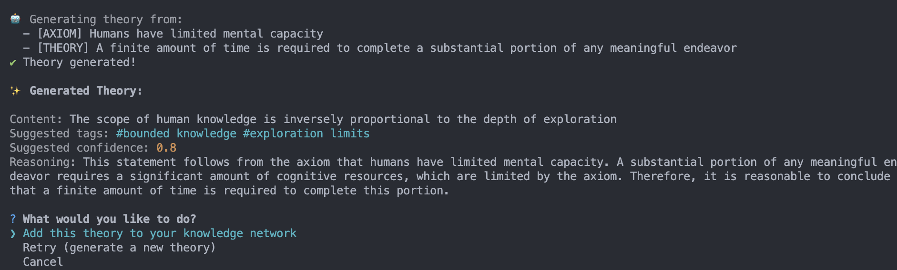

# KnowNet

A personal knowledge network for tracking beliefs, theories, and conclusions with derivation chains.



## Overview

KnowNet helps you build a structured network of knowledge starting from fundamental beliefs (axioms) and deriving theories and conclusions from them. It tracks the relationships between statements, detects contradictions, and can even assist in generating new theories.

## Features

- **Statement Types**: Support for axioms (fundamental beliefs), theories (derived principles), and conclusions
- **Derivation Tracking**: Full chain of reasoning from axioms to conclusions
- **Contradiction Detection**: Automatic detection of logical contradictions
- **Query System**: Powerful search and filtering capabilities
- **Confidence Levels**: Optional confidence tracking with propagation
- **AI Integration**: Generate new theories with AI assistance (Claude)
- **Data Persistence**: JSON-based storage with backup support
- **Export Options**: Export to Markdown format

## Installation

```bash
npm install
npm run build
```

## Usage

KnowNet offers multiple ways to interact with your knowledge network:

### 1. Web Interface (NEW!)

A modern React-based web UI with interactive graph visualization:

```bash
# Start the API server
npm run api:dev

# In a new terminal, start the frontend
cd frontend
npm install
npm start
```

Open http://localhost:3000 to access the web interface featuring:
- 🌐 Interactive graph visualization with vis.js
- 📝 Real-time statement management
- 🔍 Smart search and filtering
- 🤖 AI-powered features

### 2. Interactive CLI Mode

For a terminal-based interface:

```bash
npm run interactive
```

This provides:
- 🎨 Colorful, intuitive menus
- ✨ Step-by-step guided workflows
- 🔄 Continuous operation without restarting
- 📝 Smart prompts with validation

### 3. Command-Line Mode

For scripting and automation, use the traditional command-line interface.

### Adding Statements

Add an axiom (fundamental belief):
```bash
npm start add axiom "Humans need food to survive" --tags biology,survival --confidence 1.0
```

Add a theory derived from existing statements:
```bash
npm start add theory "Resource allocation requires prioritization" --from axiom-1,axiom-2 --tags economics
```

Add a conclusion:
```bash
npm start add conclusion "Food distribution systems are essential" --from theory-1 --confidence 0.9
```

### Querying the Network

List all statements:
```bash
npm start list
```

List only axioms:
```bash
npm start list axiom
```

Search by content:
```bash
npm start query "resource"
```

Advanced query with filters:
```bash
npm start query "economic" --type theory --tags economics --min-confidence 0.8
```

### Exploring Relationships

Show derivation chain for a statement:
```bash
npm start chain <statement-id>
```

### Managing the Network

Check for contradictions:
```bash
npm start check
```

View statistics:
```bash
npm start stats
```

Export to Markdown:
```bash
npm start export knowledge-export.md
```

Create a backup:
```bash
npm start backup
```

Delete a statement:
```bash
npm start delete <statement-id>
```

### AI-Assisted Theory Generation

Generate new theories from existing statements:
```bash
npm start derive --statements axiom-1,axiom-2 --prompt "What economic implications follow?"
```

## Example Workflow

1. Start with fundamental axioms:
   ```bash
   npm start add axiom "Humans have limited time" --tags time,human
   npm start add axiom "Learning requires time investment" --tags learning,time
   ```

2. Derive theories:
   ```bash
   npm start add theory "People must prioritize what to learn" --from <id1>,<id2> --tags learning,decision
   ```

3. Check for contradictions:
   ```bash
   npm start check
   ```

4. Generate new insights:
   ```bash
   npm start derive --statements <theory-id> --prompt "What are the implications for education?"
   ```

## Data Structure

Statements are stored in JSON format with the following structure:
- `id`: Unique identifier
- `type`: axiom, theory, or conclusion
- `content`: The statement text
- `confidence`: Optional confidence level (0-1)
- `tags`: Array of descriptive tags
- `derivedFrom`: Array of parent statement IDs
- `createdAt`: Creation timestamp
- `updatedAt`: Last update timestamp

## Development

Run in development mode:
```bash
npm run dev
```

Run tests:
```bash
npm test
```

## API Documentation

KnowNet includes a REST API for building custom integrations. See [API.md](API.md) for full documentation.

## Future Enhancements

- ~~Visual graph representation~~ ✅ Done with web UI!
- Real Claude API integration for theory generation
- More sophisticated contradiction detection
- Collaborative knowledge building
- Import from various formats
- Reasoning rule customization
- Mobile app support
